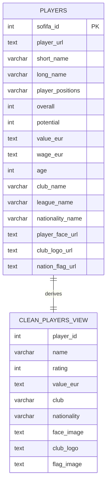

# FIFA 22 Ultimate Scout

## Authors

- Jason Oliver Stoltz Godiksen - bvp298
- Frederik Schow Morthorst - ghw695
- Marcus Karberg Kristensen - phf215
- Victor Panduro Andersen - xkf701

---
FIFA 22 Ultimate Scout is a small Streamlit web app backed by PostgreSQL. It lets a user search FIFA 22 player data with regular expressions and open random "player packs" that are selected directly from the database.

## Repository Contents

- `app.py` - Streamlit application.
- `scripts/init.sql` - database schema, CSV import, and SQL view creation.
- `players_22.csv` - FIFA 22 player dataset loaded into PostgreSQL on first startup.
- `docker-compose.yml` - starts the PostgreSQL database and Streamlit web app.
- `Dockerfile` and `requirements.txt` - build the Python web container.
- `docs/er_diagram.md` - E/R diagram and notes for the database model.

## Prerequisites

Install Docker Desktop or another Docker setup with Docker Compose v2.

## Compile / Build From Source

From the repository root, build the web application image and start the database:

```bash
docker compose up --build
```

On first startup, PostgreSQL runs `scripts/init.sql`. The script creates the `players` table, imports `players_22.csv`, and creates the `clean_players` SQL view used by the app.

If the database has already been initialized and you want to reload it from scratch, run:

```bash
docker compose down -v
docker compose up --build
```

## Run and Interact With the Web App

After `docker compose up --build` is running, open:

```text
http://localhost:8501
```

The app has two main interactions:

- Advanced Player Search: enter a PostgreSQL regular expression for player names, for example `^Lionel` or `(son|sen)$`.
- Open Player Packs: click the Bronze, Silver, or Gold pack buttons to draw eight random players from the database.

Stop the app with `Ctrl+C` in the terminal. To remove the containers, run:

```bash
docker compose down
```

## Database Model

The database model is documented in `docs/er_diagram.md`.

In short, the app loads the source CSV into one base entity, `players`, and exposes a smaller SQL view, `clean_players`, for the Streamlit UI.



## SQL and Regular Expression Requirements

The web app interacts with PostgreSQL using SQL `SELECT` statements. Examples include:

- pack opening queries that select random players by rating tier.
- regex search query using PostgreSQL's case-insensitive regex operator `~*`.

The regex search is parameterized in `app.py`, so the user's pattern is passed as a query parameter instead of being concatenated into SQL.

The database also uses the SQL view `clean_players`, which is defined in `scripts/init.sql`.

## AI Declaration

See [AI_DECLARATION.md](AI_DECLARATION.md).
