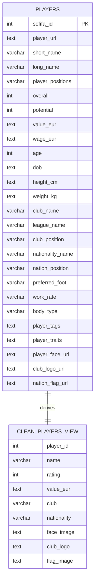

# E/R Diagram

The application uses a compact database model based on the FIFA 22 player dataset.

`players` is the base entity loaded from `players_22.csv`. `clean_players` is a SQL view derived from `players`; it keeps only the columns needed by the Streamlit UI.

## Model Notes

- `players.sofifa_id` is the primary key.
- `clean_players` is not a stored table. It is a SQL view created with `CREATE OR REPLACE VIEW`.
- The app reads from `clean_players` for both player pack opening and regex search.
- The full table definition is in `scripts/init.sql`.
